---
## Front matter
title: "Отчёт по лабораторной работе №3"
subtitle: "*дисциплина:Операционные системы*"
author: "Бондаренко Елизавета Валентиновна"

## Generic otions
lang: ru-RU
toc-title: "Содержание"

## Bibliography
bibliography: bib/cite.bib
csl: pandoc/csl/gost-r-7-0-5-2008-numeric.csl

## Pdf output format
toc: true # Table of contents
toc-depth: 2
lof: true # List of figures
lot: true # List of tables
fontsize: 12pt
linestretch: 1.5
papersize: a4
documentclass: scrreprt
## I18n polyglossia
polyglossia-lang:
  name: russian
  options:
	- spelling=modern
	- babelshorthands=true
polyglossia-otherlangs:
  name: english
## I18n babel
babel-lang: russian
babel-otherlangs: english
## Fonts
mainfont: PT Serif
romanfont: PT Serif
sansfont: PT Sans
monofont: PT Mono
mainfontoptions: Ligatures=TeX
romanfontoptions: Ligatures=TeX
sansfontoptions: Ligatures=TeX,Scale=MatchLowercase
monofontoptions: Scale=MatchLowercase,Scale=0.9
## Biblatex
biblatex: true
biblio-style: "gost-numeric"
biblatexoptions:
  - parentracker=true
  - backend=biber
  - hyperref=auto
  - language=auto
  - autolang=other*
  - citestyle=gost-numeric
## Pandoc-crossref LaTeX customization
figureTitle: "Рис."
tableTitle: "Таблица"
listingTitle: "Листинг"
lofTitle: "Список иллюстраций"
lotTitle: "Список таблиц"
lolTitle: "Листинги"
## Misc options
indent: true
header-includes:
  - \usepackage{indentfirst}
  - \usepackage{float} # keep figures where there are in the text
  - \floatplacement{figure}{H} # keep figures where there are in the text
---

#### **Цель работы:**
Целью данной работы является изучение идеологии и применения средств
контроля версий, а также освоение умения по работе с git.

#### **Ход работы:**

1. Создаю учётную запись на https://github.com. Заполняю основные данные (рис. [-@fig:001])

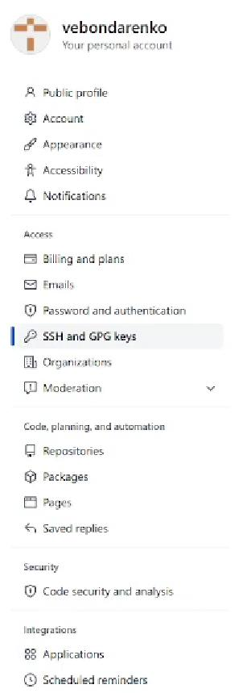{ #fig:001 width=70% }

2. Начинаю базовую настройку git. Задаю имя и email владельца репозитория (рис. [-@fig:002])

{ #fig:002 width=70% }

   Настраиваю utf-8 в выводе сообщений git (рис. [-@fig:003])

{ #fig:003 width=70% }
   
   Настраиваю верификацию и подписание коммитов git. Задаю имя начальной
ветки (допустим master) (рис. [-@fig:004]). А также параметр autocrlf и параметр safecrlf (рис. [-@fig:005]).

{ #fig:004 width=70% }

{ #fig:005 width=70% }

3. Создаю ключи ssh – по алгоритму rsa с ключом размером 4096 бит и по
алгоритму ed25519 (рис. [-@fig:006])  и (рис. [-@fig:007])

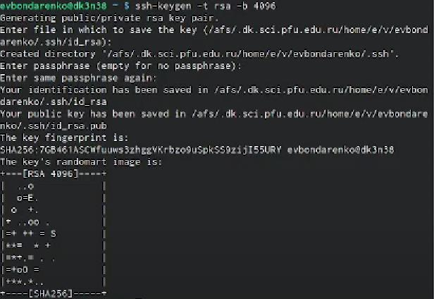{ #fig:006 width=70% }

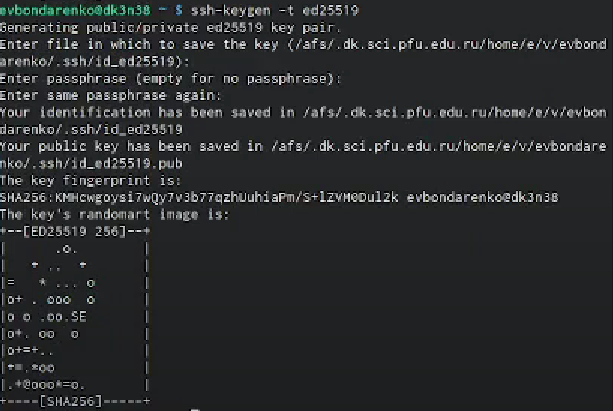{ #fig:007 width=70% }

   Создаю ключи gpg. Генерирую ключ. Из предложенных опций выбираю: – тип
RSA and RSA; – размер 4096; срок действия: значение по умолчанию— 0 (срокдействия не истекает никогда). – GPG запросил личную информацию, которая
сохранится в ключе: – Имя. – Адрес электронной почты. – Ввожу email, используемый
на GitHub. – Комментарий. Нажимаю клавишу ввода, чтобы оставить это поле пустым (рис. [-@fig:008])

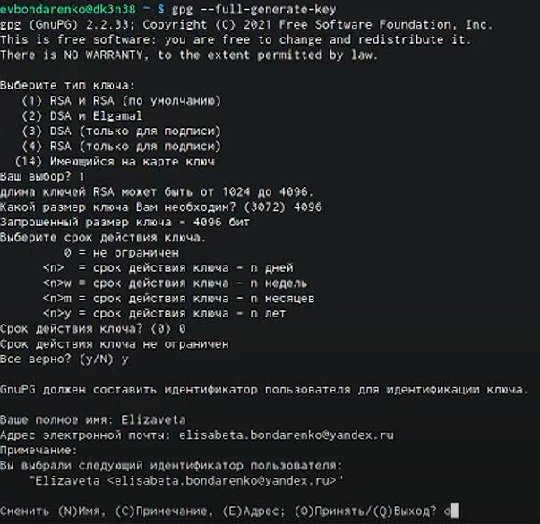{ #fig:008 width=70% }

4. Добавляю GPG ключ в GitHub. Вывожу список ключей и копирую отпечаток
приватного ключа. Копирую сгенерированный GPG ключ в буфер обмена (рис. [-@fig:009]) .
Перехожу в настройки GitHub (https://github.com/settings/keys), нажмаю на кнопку New
GPG key и вставляю полученный ключ в поле ввода (рис. [-@fig:010])

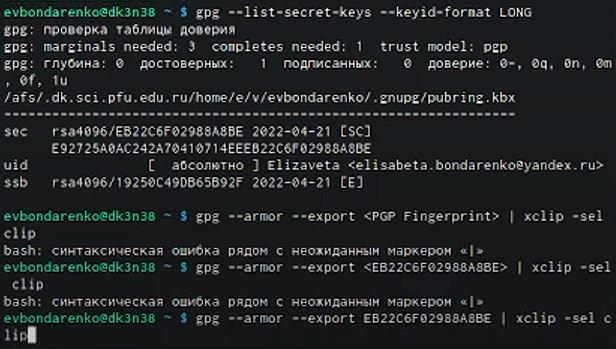{ #fig:009 width=70% }

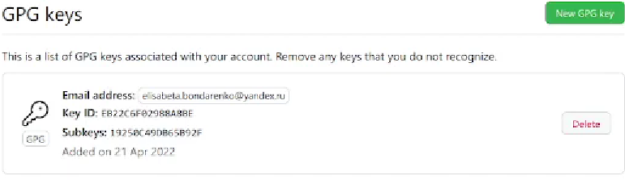{ #fig:010 width=70% }

5. Настраиваю автоматические подписи коммитов git. Используя введённый email,
указываю Git применять его при подписи коммитов (рис. [-@fig:011])

{ #fig:011 width=70% }

   Используя шаблон для рабочего пространства
(https://github.com/yamadharma/course-directory-student-template), создаю репозиторий
os-intro (рис. [-@fig:012])

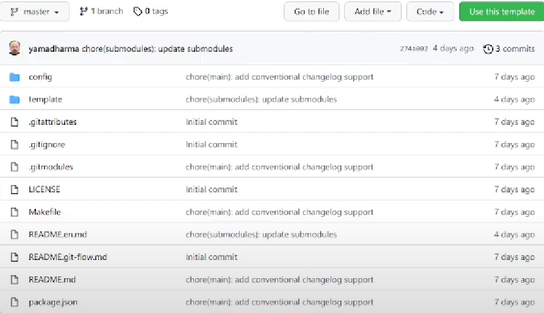{ #fig:012 width=70% }

   Создаю репозиторий курса на основе шаблона. Для этого я создаю каталог
«Операционные системы» и перехожу в него . Далее на github я копирую ссылку на
свой репозиторий  и заполняю репозиторий по шаблону, добавляя ссылку в
команду git clone –recursive (рис. [-@fig:013])

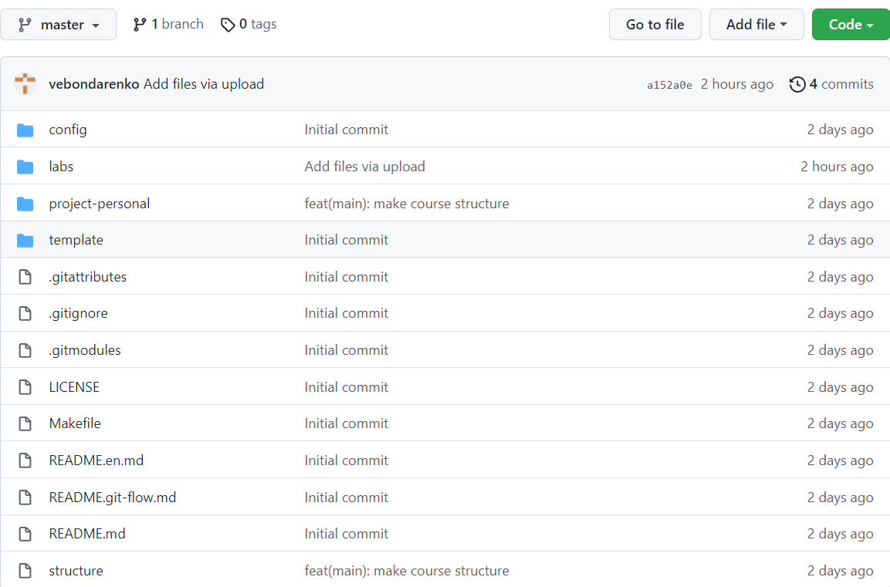{ #fig:013 width=70% }

6.   Настраиваю каталог курса. Перехожу в каталог курса (рис. [-@fig:014]). Удаляю лишние
файлы (package.json), но для начала проверяю его наличие в каталоге с помощью
команды ls (рис. [-@fig:015]). Создаю необходимые каталоги (рис. [-@fig:016]). Отправляю файлы на
сервер

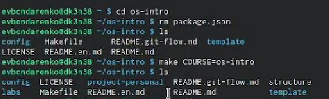{ #fig:014 width=70% }

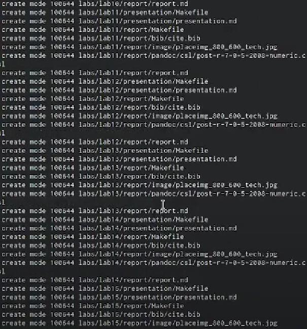{ #fig:015 width=70% }

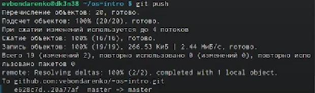{ #fig:016 width=70% }

#### **Контрольные вопросы:**
1. **Version Control System** — программное обеспечение для облегчения работы с
изменяющейся информацией. Системы контроля версий (Version Control System, VCS)
применяются при работе нескольких человек над одним проектом. Обычно основное
дерево проекта хранится в локальном или удалённом репозитории, к которому
настроен доступ для участников проекта. При внесении изменений в содержание
проекта система контроля версий позволяет их фиксировать, совмещать изменения,
произведённые разными участниками проекта, производить откат к любой более
ранней версии проекта, если это требуется
2. В классических системах контроля версий используется централизованная
модель, предполагающая наличие единого репозитория для хранения файлов.
Выполнение большинства функций по управлению версиями осуществляется
специальным сервером. Участник проекта (пользователь) перед началом работы
посредством определённых команд получает нужную ему версию файлов. Послевнесения изменений, пользователь размещает новую версию в хранилище. При этом
предыдущие версии не удаляются из центрального хранилища и к ним можно
вернуться в любой момент. Сервер может сохранять неполную версию изменённых
файлов, а производить так называемую дельта-компрессию—сохранять только
изменения между последовательными версиями, что позволяет уменьшить объём
хранимых данных.
Системы контроля версий также могут обеспечивать дополнительные, более гибкие
функциональные возможности. Например, они могут поддерживать работу с
несколькими версиями одного файла, сохраняя общую историю изменений до точки
ветвления версий и собственные истории изменений каждой ветви. Кроме того,
обычно доступна информация о том, кто из участников, когда и какие изменения
вносил. Обычно такого рода информация хранится в журнале изменений, доступ к
которому можно ограничить.
3. Централизованные системы — это системы, которые используют архитектуру
клиент / сервер, где один или несколько клиентских узлов напрямую подключены к
центральному серверу. **Пример - Wikipedia**.
В децентрализованных системах каждый узел принимает свое собственное решение.
Конечное поведение системы является совокупностью решений отдельных узлов.
**Пример — Bitcoin**.
В классических системах контроля версий используется централизованная модель,
предполагающая наличие единого репозитория для хранения файлов. Выполнение
большинства функций по управлению версиями осуществляется специальным
сервером.
4. Создадим локальный репозиторий. Сначала сделаем предварительную
конфигурацию, указав имя и email владельца репозитория:
git config --global user.name"Имя Фамилия"
git config --global user.email"work@mail"
и настроив utf-8 в выводе сообщенийgit:
git config --global quotepath false
Для инициализации локального репозитория, расположенного, например, в каталоге
~/tutorial, необходимо ввести в командной строке:
cd
mkdir tutorial
cd tutorial
git init
5. Для последующей идентификации пользователя на сервере репозиториев
необходимо сгенерировать пару ключей (приватный и открытый):
ssh-keygen -C"Имя Фамилия <work@mail>"
Ключи сохраняться в каталоге~/.ssh/.
Скопировав из локальной консоли ключ в буфер обмена
cat ~/.ssh/id_rsa.pub | xclip -sel clip
вставляем ключ в появившееся на сайте поле.
6. У Git две **основных задачи**: первая — хранить информацию о всех изменениях
в вашем коде, начиная с самой первой строчки, а вторая — обеспечивать удобства
командной работы над кодом.
7. **Основные команды git**:
Наиболее часто используемые команды git: – создание основного дерева репозитория:git init–получение обновлений (изменений)текущего дерева из центрального
репозитория: git pull–отправка всех произведённых изменений локального дерева в
центральный репозиторий: git push–просмотр списка изменённых файлов в текущей
директории: git status–просмотр текущих изменений: git diff–сохранение текущих
изменений:–добавить все изменённые и/или созданные файлы и/или каталоги: git add
.–добавить конкретные изменённые и/или созданные файлы и/или каталоги:git add
имена_файлов – удалить файл и/или каталог из индекса репозитория (при этом файл
и/или каталог остаётся в локальной директории): git rm имена_файлов – сохранение
добавленных изменений: – сохранить все добавленные изменения и все изменённые
файлы: git commit -am 'Описание коммита'–сохранить добавленные изменения с
внесением комментария через встроенный редактор: git commit–создание новой ветки,
базирующейся натекущей: git checkout -b имя_ветки–переключение на некоторую
ветку: git checkout имя_ветки (при переключении на ветку, которой ещё нет в
локальном репозитории, она будет создана и связана с удалённой) – отправка
изменений конкретной ветки в центральный репозиторий: git push origin имя_ветки–
слияние ветки стекущим деревом:git merge --no-ff имя_ветки–удаление ветки: –
удаление локальной уже слитой с основным деревом ветки:git branch -d имя_ветки–
принудительное удаление локальной ветки:git branch -D имя_ветки–удаление ветки с
центрального репозитория: git push origin :имя_ветки
8. Использования git при работе с локальными репозиториями (добавления
текстового документа в локальный репозиторий):
git add hello.txt
git commit -am' Новый файл
9. Проблемы, которые решают ветки git:
- нужно постоянно создавать архивы с рабочим кодом
- сложно "переключаться" между архивами
- сложно перетаскивать изменения между архивами
- легко что-то напутать или потерять
10. Во время работы над проектом так или иначе могут создаваться файлы,
которые не требуется добавлять в последствии в репозиторий. Например, временные
файлы, создаваемые редакторами, или объектные файлы, создаваемые
компиляторами. Можно прописать шаблоны игнорируемых при добавлении в
репозиторий типов файлов в файл gitignore с помощью сервисов. Для этого сначала
нужно получить списки меняющихся шаблонов: curl -L -s
https://www.gitignore.io/api/list
Затем скачать шаблон, например, для C и C++
curl -L -s https://www.gitignore.io/api/c >> .gitignore
curl -L -s https://www.gitignore.io/api/c++ >> .gitignore

#### **Вывод:**
В ходе выполнения данной лабораторной работы я приобрела
практические навыки работы с github, научилась создавать репозитории и размещать
файлы в них, что упростит работу со следующими лабораторными работами и
поможет структурировать информацию, а также я изучила идеологию применения
средств контроля версий.

# Список литературы{.unnumbered}

::: {#refs}
:::
