---
## Front matter
title: "Отчёт по лабораторной работе №7"
subtitle: "*дисциплина:Операционные системы*"
author: "Бондаренко Елизавета Валентиновна"

## Generic otions
lang: ru-RU
toc-title: "Содержание"

## Bibliography
bibliography: bib/cite.bib
csl: pandoc/csl/gost-r-7-0-5-2008-numeric.csl

## Pdf output format
toc: true # Table of contents
toc-depth: 2
lof: true # List of figures
lot: true # List of tables
fontsize: 12pt
linestretch: 1.5
papersize: a4
documentclass: scrreprt
## I18n polyglossia
polyglossia-lang:
  name: russian
  options:
	- spelling=modern
	- babelshorthands=true
polyglossia-otherlangs:
  name: english
## I18n babel
babel-lang: russian
babel-otherlangs: english
## Fonts
mainfont: PT Serif
romanfont: PT Serif
sansfont: PT Sans
monofont: PT Mono
mainfontoptions: Ligatures=TeX
romanfontoptions: Ligatures=TeX
sansfontoptions: Ligatures=TeX,Scale=MatchLowercase
monofontoptions: Scale=MatchLowercase,Scale=0.9
## Biblatex
biblatex: true
biblio-style: "gost-numeric"
biblatexoptions:
  - parentracker=true
  - backend=biber
  - hyperref=auto
  - language=auto
  - autolang=other*
  - citestyle=gost-numeric
## Pandoc-crossref LaTeX customization
figureTitle: "Рис."
tableTitle: "Таблица"
listingTitle: "Листинг"
lofTitle: "Список иллюстраций"
lotTitle: "Список таблиц"
lolTitle: "Листинги"
## Misc options
indent: true
header-includes:
  - \usepackage{indentfirst}
  - \usepackage{float} # keep figures where there are in the text
  - \floatplacement{figure}{H} # keep figures where there are in the text
---

# Цель работы

Освоение основных возможностей командной оболочки Midnight Commander. Приобретение навыков практической работы по просмотру каталогов и файлов; манипуляций
с ними.

# Задание

7.3.1. Задание по mc
1. Изучите информацию о mc, вызвав в командной строке man mc.
2. Запустите из командной строки mc, изучите его структуру и меню
3. Выполните несколько операций в mc, используя управляющие клавиши (операции
с панелями; выделение/отмена выделения файлов, копирование/перемещение файлов, получение информации о размере и правах доступа на файлы и/или каталоги
и т.п.)
4. Выполните основные команды меню левой (или правой) панели. Оцените степень
подробности вывода информации о файлах.
5. Используя возможности подменю Файл , выполните:
– просмотр содержимого текстового файла;
– редактирование содержимого текстового файла (без сохранения результатов
редактирования);
– создание каталога;
– копирование в файлов в созданный каталог.
6. С помощью соответствующих средств подменю Команда осуществите:
– поиск в файловой системе файла с заданными условиями (например, файла
с расширением .c или .cpp, содержащего строку main);
– выбор и повторение одной из предыдущих команд;
– переход в домашний каталог;
– анализ файла меню и файла расширений.
7. Вызовите подменю Настройки . Освойте операции, определяющие структуру экрана mc
(Full screen, Double Width, Show Hidden Files и т.д.)
7.3.2. Задание по встроенному редактору mc
1. Создайте текстовой файл text.txt.
2. Откройте этот файл с помощью встроенного в mc редактора.
3. Вставьте в открытый файл небольшой фрагмент текста, скопированный из любого
другого файла или Интернета.
4. Проделайте с текстом следующие манипуляции, используя горячие клавиши:
4.1. Удалите строку текста.
4.2. Выделите фрагмент текста и скопируйте его на новую строку.
4.3. Выделите фрагмент текста и перенесите его на новую строку.
4.4. Сохраните файл.
4.5. Отмените последнее действие.
4.6. Перейдите в конец файла (нажав комбинацию клавиш) и напишите некоторый
текст.
4.7. Перейдите в начало файла (нажав комбинацию клавиш) и напишите некоторый
текст.
4.8. Сохраните и закройте файл.
5. Откройте файл с исходным текстом на некотором языке программирования (например C или Java)
6. Используя меню редактора, включите подсветку синтаксиса, если она не включена,
или выключите, если она включена.

# Выполнение лабораторной работы

1. Вызываем в командной строке man mc (рис. [-@fig:001])

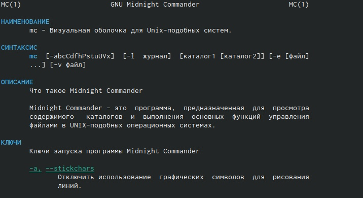{ #fig:001 width=70% }

2. Запускаем из командной строки mc, изучаем его структуру и меню. (рис. [-@fig:002])

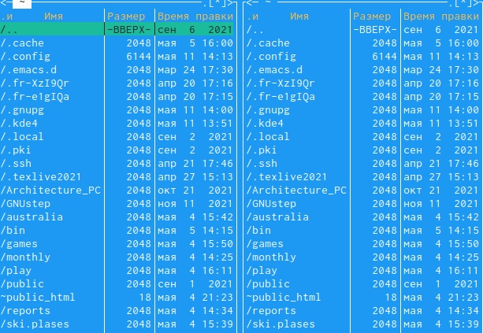{ #fig:002 width=70% }

3. Выполняем несколько операций в mc (рис. [-@fig:003]) (рис. [-@fig:004]) (рис. [-@fig:005]) 

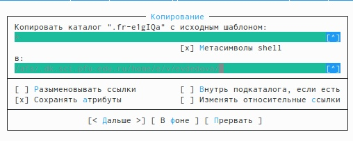{ #fig:003 width=70% }

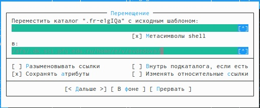{ #fig:004 width=70% }

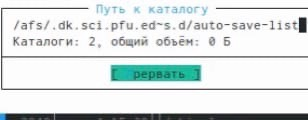{ #fig:005 width=70% }

4. Выполняем основные команды меню левой панели (рис. [-@fig:006])

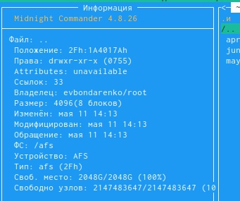{ #fig:006 width=70% }

5. Используя возможности подменю "Файл", выполняем:

- просмотр содержимого текстового файла (рис. [-@fig:007])

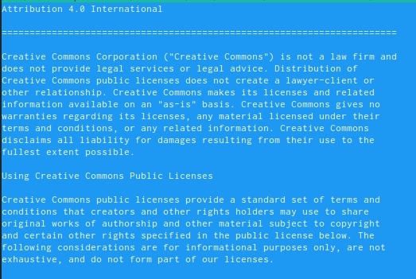{ #fig:007 width=70% }

- редактирование содержимого текстового файла (рис. [-@fig:008])

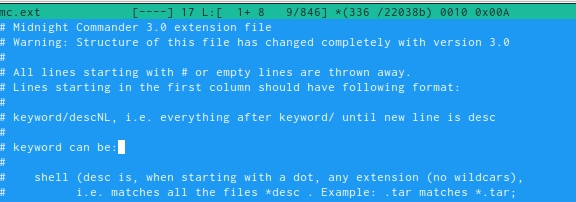{ #fig:008 width=70% }

- создание каталога (рис. [-@fig:009])

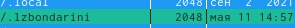{ #fig:009 width=70% }

- копирование файл в созданный каталог (рис. [-@fig:010])

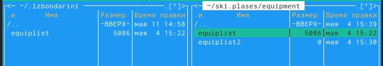{ #fig:010 width=70% }

6. С помощью соответствующих стредств подменю Команда осуществляем:

- поиск в файловой системе файла с заданными условиями (например, файла
с расширением .c или .cpp, содержащего строку main) (рис. [-@fig:011])

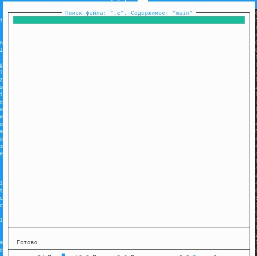{ #fig:011 width=70% }

- повторение одной из предыдущих команд (рис. [-@fig:012])

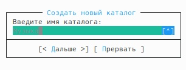{ #fig:012 width=70% }

- анализ файла расширения (рис. [-@fig:013])

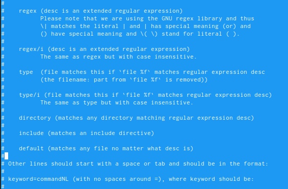{ #fig:013 width=70% }

- анализ файла меню (рис. [-@fig:014])

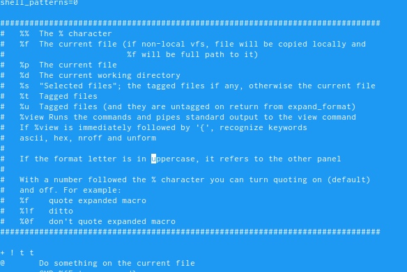{ #fig:014 width=70% }

7. Вызываем подменю Настройки и осваиваем операции, определяющие структуру экрана mc
(Full screen, Double Width, Show Hidden Files и т.д.) (рис. [-@fig:015])

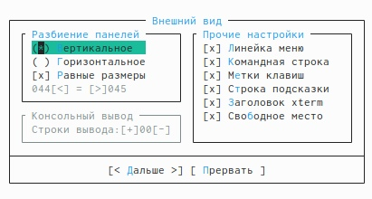{ #fig:015 width=70% }

1. Создаём текстовый файл text.txt (рис. [-@fig:016])

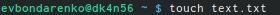{ #fig:016 width=70% }

2. Открываем с помощью команды mc (рис. [-@fig:017])

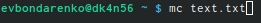{ #fig:017 width=70% }

3.  Вставляем в открытый файл небольшой фрагмент текста, скопированный из любого
другого файла или Интернета. (рис. [-@fig:018])

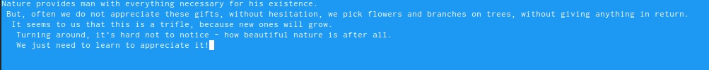{ #fig:018 width=70% }

4. Удаляем строку текста (рис. [-@fig:019])

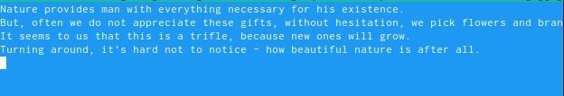{ #fig:019 width=70% }

Выделяем фрагмент текста и копируем его на новую строку (рис. [-@fig:020])

{ #fig:020 width=70% }

Отменяем последнее действие (рис. [-@fig:021])

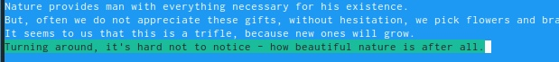{ #fig:021 width=70% }

Переходим сначала в конец файла, а затем в начало файла и вставляем текст (рис. [-@fig:022])

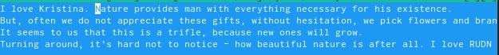{ #fig:022 width=70% }

5. Открываем файл с текстом на языке программирования и прооверяем подсветку синтаксиса (рис. [-@fig:023])

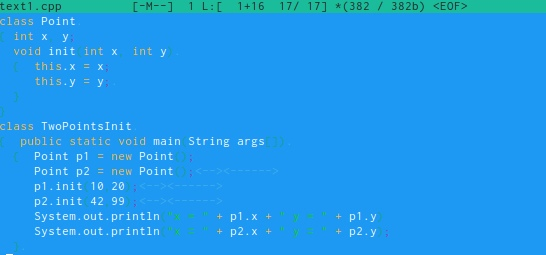{ #fig:023 width=70% }

# Контрольные вопросы:
1) Редактор vi имеет три режима работы:
- командный режим − предназначен для ввода команд редактирования
и навигации по редактируемому файлу;
- режим вставки − предназначен для ввода содержания
редактируемого файла;
- режим последней (или командной) строки − используется для записи
изменений в файл и выхода из редактора.
2) Чтобы выйти из редактора, не сохраняя произведённые изменения,
нужно в режиме командной строки нажать клавиши «:» «q» «!»
3) Команды позиционирования:
- «0» (ноль) − переход в начало строки;
- «$» − переход в конец строки;
- «G» − переход в конец файла; 
- n«G» − переход на строку с номером n.
4) При использовании прописных W и B под разделителями понимаются
только пробел, табуляция и возврат каретки. При использовании
строчных w и b под разделителями понимаются также любые знаки
пунктуации.
5) Чтобы из любого места редактируемого файла перейти в начало (конец)
файла, нужно в режиме командной строки нажать клавиши «1» «G»
(«G»).
6) Команды редактирования:
Вставка текста
- «а» − вставить текст после курсора;
- «А» − вставить текст в конец строки;
- «i» − вставить текст перед курсором;
- n «i» − вставить текст n раз;
- «I» − вставить текст в начало строки.
Вставка строки
- «о» − вставить строку под курсором;
- «О» − вставить строку над курсором.
Удаление текста
- «x» − удалить один символ в буфер;
- «d» «w» − удалить одно слово в буфер;
- «d» «$» − удалить в буфер текст от курсора до конца строки;
- «d» «0» − удалить в буфер текст от начала строки до позиции
курсора;
- «d» «d» − удалить в буфер одну строку;
- n «d» «d» − удалить в буфер n строк.
Отмена и повтор произведённых изменений
- «u» − отменить последнее изменение;
- «.» − повторить последнее изменение
Копирование текста в буфер
- «Y» − скопировать строку в буфер;
- n «Y» − скопировать n строк в буфер;
- «y» «w» − скопировать слово в буфер.
Вставка текста из буфера
- «p» − вставить текст из буфера после курсора;
- «P» − вставить текст из буфера перед курсором.
Замена текста
- «c» «w» − заменить слово;
- n «c» «w» − заменить n слов;
- «c» «$» − заменить текст от курсора до конца строки;
- «r» − заменить слово;
- «R» − заменить текст.
Поиск текста
- «/» текст − произвести поиск вперёд по тексту указанной строки
символов текст;
- «?» текст − произвести поиск назад по тексту указанной строки
символов текст.
Копирование и перемещение текста
- «:» n,m «d» – удалить строки с n по m;
- «:» i,j «m» k – переместить строки с i по j, начиная со строки k;
- «:» i,j «t» k – копировать строки с i по j в строку k;
- «:» i,j «w» имя-файла – записать строки с i по j в файл с именем
имя-файла.
7) Чтобы заполнить строку символами $, необходимо для начала перейти
на эту строку, нажав клавиши n «G», где n – номер строки, далее нажать
«0» для перехода в начало строки. Теперь необходимо нажать «c» «$»,
чтобы заменить текст от курсора до конца строки, и ввести символы $.
8) Чтобы отменить по одному предыдущему действию последовательно, необходимо нажать «u». Чтобы отменить все изменения, произведённые
со времени последней записи, нужно нажать «:» «e» «!».
9) Команды редактирования в режиме командной строки
Копирование и перемещение текста
- «:» n,m «d» − удалить строки с n по m;
- «:» i,j «m» k − переместить строки с i по j, начиная со строки k;
- «:» i,j «t» k − копировать строки с i по j в строку k;
- «:» i,j «w» имя-файла − записать строки с i по j в файл с именем
имя-файла.
Запись в файл и выход из редактора
- «:» «w» − записать изменённый текст в файл, не выходя из vi;
- «:» «w» имя-файла − записать изменённый текст в новый файл с
именем имя-файла;
- «:» «w» «!» имя-файла − записать изменённый текст в файл с
именем имя-файла;
- «:» «w» «q» − записать изменения в файл и выйти из vi;
- «:» «q» − выйти из редактора vi;
- «:» «q» «!» − выйти из редактора без записи;
- «:» «e» «!» − вернуться в командный режим, отменив все
изменения, произведённые со времени последней записи.
Опции
Опции редактора vi позволяют настроить рабочую среду. Для задания
опций используется команда set (в режиме последней строки):
- «:» set all − вывести полный список опций;
- «:» set nu − вывести номера строк;
- «:» set list − вывести невидимые символы;
- «:» set ic − не учитывать при поиске, является ли символ
прописным или строчным.
Если вы хотите отказаться от использования опции, то в команде set
перед именем опции надо поставить no.
10) Чтобы определить, не перемещая курсора, позицию, в которой
заканчивается строка, нужно в командном режиме находясь на нужной
строке нажать «$» и посмотреть на число после запятой в правом
нижнем углу экрана.
11) Опции редактора vi позволяют настроить рабочую среду. Для
задания опций используется команда set (в режиме командной строки).
Если вы хотите отказаться от использования опции, то в команде set
перед именем опции надо поставить no.
Чтобы просмотреть опции редактора vi, необходимо нажать «:» set all. Нажав «:» help “название_опции”, можно узнать назначение конкретной опции.
12) В режиме командной строки внизу редактора присутствует «:», в
режиме ввода – «-- ВСТАВКА --», в командном режиме внизу ничего
нет. 
13) Граф взаимосвязи режимов работы редактора vi (рис. [-@fig:024])

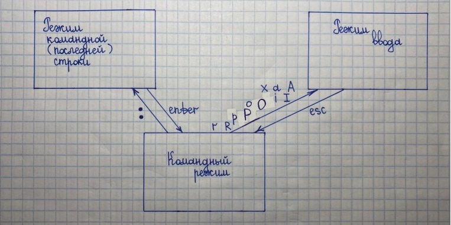{ #fig:024 width=70% }

# Выводы

В ходе выполнения данной лабораторной работы я освоила основные возможности командной оболочки Midnight Commander, приобрела навыки практической работы по просмотру каталогов и файлов; манипуляций с ними.

# Список литературы{.unnumbered}

::: {#refs}
:::
