---
## Front matter
title: "Отчёт по лабораторной работе №14"
subtitle: "*дисциплина:Операционные системы*"
author: "Бондаренко Елизавета Валентиновна"

## Generic otions
lang: ru-RU
toc-title: "Содержание"

## Bibliography
bibliography: bib/cite.bib
csl: pandoc/csl/gost-r-7-0-5-2008-numeric.csl

## Pdf output format
toc: true # Table of contents
toc-depth: 2
lof: true # List of figures
lot: true # List of tables
fontsize: 12pt
linestretch: 1.5
papersize: a4
documentclass: scrreprt
## I18n polyglossia
polyglossia-lang:
  name: russian
  options:
	- spelling=modern
	- babelshorthands=true
polyglossia-otherlangs:
  name: english
## I18n babel
babel-lang: russian
babel-otherlangs: english
## Fonts
mainfont: PT Serif
romanfont: PT Serif
sansfont: PT Sans
monofont: PT Mono
mainfontoptions: Ligatures=TeX
romanfontoptions: Ligatures=TeX
sansfontoptions: Ligatures=TeX,Scale=MatchLowercase
monofontoptions: Scale=MatchLowercase,Scale=0.9
## Biblatex
biblatex: true
biblio-style: "gost-numeric"
biblatexoptions:
  - parentracker=true
  - backend=biber
  - hyperref=auto
  - language=auto
  - autolang=other*
  - citestyle=gost-numeric
## Pandoc-crossref LaTeX customization
figureTitle: "Рис."
tableTitle: "Таблица"
listingTitle: "Листинг"
lofTitle: "Список иллюстраций"
lotTitle: "Список таблиц"
lolTitle: "Листинги"
## Misc options
indent: true
header-includes:
  - \usepackage{indentfirst}
  - \usepackage{float} # keep figures where there are in the text
  - \floatplacement{figure}{H} # keep figures where there are in the text
---

# Цель работы

В ходе выполнения лабораторной работы я должна ознакомиться  с файловой системой Linux, её структурой, именами и содержанием
каталогов. А также приобрести практические навыки по применению команд для работы
с файлами и каталогами, по управлению процессами (и работами), по проверке использования диска и обслуживанию файловой системы.

# Последовательности выполнения работы

1. Выполняем  все примеры, приведённые в первой части описания лабораторной работы.
2. Выполняем следующие действия, зафиксировав в отчёте по лабораторной работе
используемые при этом команды и результаты их выполнения:
2.1. Копируем файл /usr/include/sys/io.h в домашний каталог и называем  его
equipment. Если файла io.h нет, то используем любой другой файл в каталоге
/usr/include/sys/ вместо него.
2.2. В домашнем каталоге создаем директорию ~/ski.plases.
2.3. Перемещаем  файл equipment в каталог ~/ski.plases.
2.4. Переименуем файл ~/ski.plases/equipment в ~/ski.plases/equiplist.
2.5. Создаем в домашнем каталоге файл abc1 и копируем  его в каталог
~/ski.plases, называем его equiplist2.
2.6. Создаем каталог с именем equipment в каталоге ~/ski.plases.
2.7. Перемещаем  файлы ~/ski.plases/equiplist и equiplist2 в каталог
~/ski.plases/equipment.
2.8. Создаем и перемещаем каталог ~/newdir в каталог ~/ski.plases и называем
его plans.

3. Определяем опции команды chmod, необходимые для того, чтобы присвоить перечисленным ниже файлам выделенные права доступа, считая, что в начале таких прав
нет.
При необходимости создаем нужные файлы.
4. Проделаем приведённые ниже упражнения, записывая в отчёт по лабораторной
работе используемые при этом команды:
4.1. Просмотрим содержимое файла /etc/password.
4.2. Скопируем файл ~/feathers в файл ~/file.old.
4.3. Переместим файл ~/file.old в каталог ~/play.
4.4. Скопируем каталог ~/play в каталог ~/fun.
4.5. Переместим каталог ~/fun в каталог ~/play и назовите его games.
4.6. Лишим владельца файла ~/feathers права на чтение.
4.7. Что произойдёт, если мы попытаетемся просмотреть файл ~/feathers командой
cat?
4.8. Что произойдёт, если мы попытаемся скопировать файл ~/feathers?
4.9. Даем владельцу файла ~/feathers право на чтение.
4.10. Лишите владельца каталога ~/play права на выполнение.
4.11. Переходим в каталог ~/play. Что произошло?
4.12. Даем владельцу каталога ~/play право на выполнение.
5. Прочитаем man по командам mount, fsck, mkfs, kill и кратко их охарактеризуем.

# Выполнение лабораторной работы

1. Выполняем  все примеры, приведённые в первой части описания лабораторной работы. Описываются проведённые действия, в качестве иллюстрации даётся ссылка на иллюстрацию. Рисунки  [-@fig:001]; [-@fig:002]; [-@fig:003].

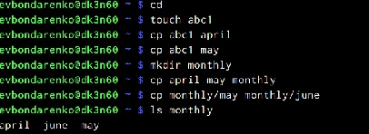{ #fig:001 width=70% }

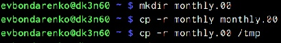{ #fig:002 width=70% }

 
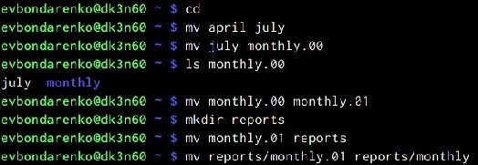{ #fig:003 width=70% }

2. Копируем файл /usr/include/sys/io.h в домашний каталог и называем  его equipment. Если файла io.h нет, то используем любой другой файл в каталоге /usr/include/sys/ вместо него.(рис.[-@fig:004]).

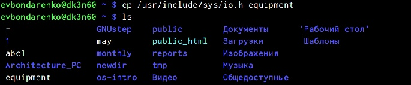{ #fig:004 width=70% }

В домашнем каталоге создаем директорию ~/ski.plases (рис.[-@fig:005]).
 
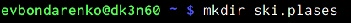{ #fig:005 width=70% }
 
  Перемещаем  файл equipment в каталог ~/ski.plases (рис.[-@fig:006]).

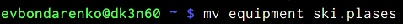{ #fig:006 width=70% }

Переименуем файл ~/ski.plases/equipment в ~/ski.plases/equiplist(рис.[-@fig:007]).
   
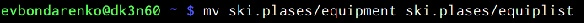{ #fig:007 width=70% }

 Создаем в домашнем каталоге файл abc1 и копируем  его в каталог
~/ski.plases, называем его equiplist2.(рис.[-@fig:008]).

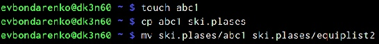{ #fig:008 width=70% }

 Создаем каталог с именем equipment в каталоге ~/ski.plases и перемещаем его(рис.[-@fig:009]).

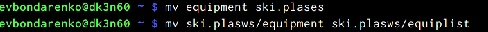{ #fig:009 width=70% }

 Создаем и перемещаем каталог ~/newdir в каталог ~/ski.plases и называем
его plans(рис.[-@fig:010]).

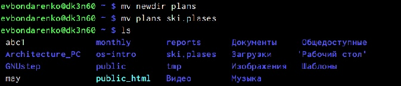{ #fig:010 width=70% }

3.  Определяем опции команды chmod, необходимые для того, чтобы присвоить перечисленным ниже файлам выделенные права доступа, считая, что в начале таких прав нет.(рис.[-@fig:011])

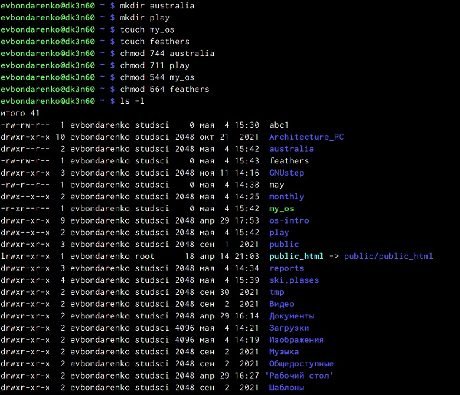{ #fig:011 width=70% }

4.  Просмотрим содержимое файла /etc/password.(рис.[-@fig:012])

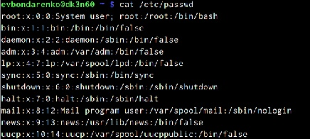{ #fig:012 width=70% }

 Скопируем файл ~/feathers в файл ~/file.old.(рис.[-@fig:013])
 
 
{ #fig:013 width=70% }

Переместим файл ~/file.old в каталог ~/play.(рис.[-@fig:014])

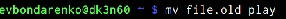{ #fig:014 width=70% }

 Скопируем каталог ~/play в каталог ~/fun.(рис.[-@fig:015])

{ #fig:015 width=70% }

Переместим каталог ~/fun в каталог ~/play и называем его games.(рис.[-@fig:016])

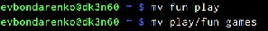{ #fig:016 width=70% }

1)Лишим владельца файла ~/feathers права на чтение (команда «chmod u-r feathers»)..(рис.[-@fig:017])
2) Если мы попытаемся просмотреть файл ~/feathers командой cat, то получим отказ в доступе, т.к. в предыдущем пункте лишили владельца права на чтение данного файла..(рис.[-@fig:017])
3) Если мы попытаемся скопировать файл ~/feathers, например, в каталог monthly, то получим отказ в доступе, по причине, описанной в предыдущем пункте.(рис.[-@fig:017])
4)Дадим владельцу файла ~/feathers право на чтение (команда «chmod u+r feathers»)(рис.[-@fig:017])
5) Лишим владельца каталога ~/play права на выполнение (команда «chmod u-x play»).(рис.[-@fig:017])
6) Перейдем в каталог ~/play (команда «cd play»). Получим отказ в доступе, т.к. в предыдущем пункте лишили владельца права на выполнение данного каталога..(рис.[-@fig:017])
7) Дадим владельцу каталога ~/play право на выполнение (команда «chmod u+x play»).(рис.[-@fig:017])

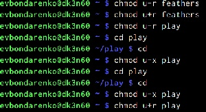{ #fig:017 width=70% }

5. Прочитаем man по командам mount, fsck, mkfs, kill.Рисунки [-@fig:018];[-@fig:019];[-@fig:020];[-@fig:021]

Команда mount:предназначена для монтирования файловой системы. Все файлы, доступные в Unix системах, составляют иерархическую файловую структуру, которая имеет ветки (каталоги) и листья (файлы в каталогах). Корень этого дерева обозначается как /. Физически файлы могут располагаться на различных устройствах. Команда mount служит для подключения файловых систем разных устройств к этому большому дереву. Наиболее часто встречающаяся форма команды mount выглядит следующим образом: «mount -t vfstype device dir» Такая команда предлагает ядру смонтировать (подключить) файловую систему указанного типа vfstype, расположенную на устройстве device, к заданному каталогу dir, который часто называют точкой монтирования.(рис.[-@fig:018])

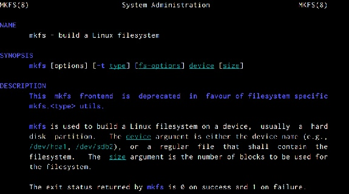{ #fig:018 width=70% }

Команда fsck: это утилита командной строки, которая позволяет выполнять проверки согласованности и интерактивное исправление в одной или нескольких файловых системах Linux. Он использует программы, специфичные для типа файловой системы, которую он проверяет. У команды fsck следующий синтаксис: fsck [параметр] -- [параметры ФС] [<файловая система> . . .] Например, если нужно восстановить («починить») файловую систему на некотором устройстве /dev/sdb2, следует воспользоваться командой: «sudo fsck -y /dev/sdb2» Опция -y необходима, т. к. при её отсутствии придётся слишком часто давать подтверждение.(рис.[-@fig:019])

{ #fig:019 width=70% }

Команда kill: посылает сигнал процессу или выводит список допустимых сигналов. Имеет следующий синтаксис: kill [опции] PID, где PID – это PID (числовой идентификатор) процесса или несколько PID процессов, если требуется послать сигнал сразу нескольким процессам. Например, команда «kill -KILL 3121» посылает сигнал KILL процессу с PID 3121, чтобы принудительно завершить процесс.(рис.[-@fig:020])

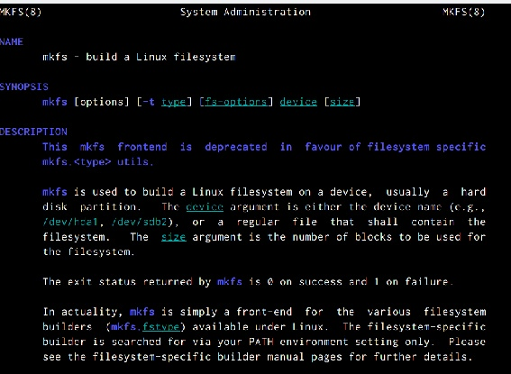{ #fig:020 width=70% }

Команда mkfs: создаёт новую файловую систему Linux. Имеет следующий синтаксис: mkfs [ -V ] [ -t fstype ] [ fs-options ] filesys [ blocks ] mkfs используется для создания файловой системы Linux на некотором устройстве, обычно в разделе жёсткого диска. В качестве аргумента filesys для файловой системы может выступать или название устройства (например, /dev/hda1, /dev/sdb2) или точка монтирования (например, /, /usr, /home). Аргументом blocks указывается количество блоков, которые выделяются для использования этой файловой системой. По окончании работы mkfs возвращает 0 - в случае успеха, а 1 - при неудачной операции. Например, команда «mkfs -t ext2 /dev/hdb1» создаёт файловую систему типа ext2 в разделе /dev/hdb1 (второй жёсткий диск).(рис.[-@fig:021])

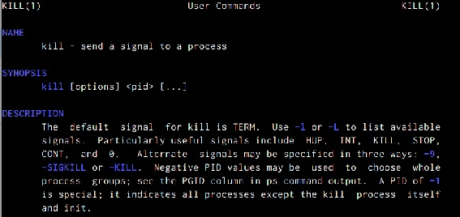{ #fig:021 width=70% }

# Контрольные вопросы
1) Чтобы узнать, какие файловые системы существуют на жёстком диске моего компьютера, использую команду «df -Th». Из
рисунка видно, что на моем компьютере есть следующие файловые системы: devtmpfs, tmpfs, ext4, iso9660.
devtmpfs позволяет ядру создать экземпляр tmpfs с именем devtmpfs при инициализации ядра, прежде чем регистрируется какое-либо
устройство с драйверами. Каждое устройство с майором / минором будет предоставлять узел устройства в devtmpfs. devtmpfs монтируется на /dev и содержит специальные файлы устройств для всех устройств.
tmpfs − временное файловое хранилище во многих Unix-подобных ОС. Предназначена для монтирования файловой системы, но
размещается в ОЗУ вместо ПЗУ. Подобная конструкция является RAM диском. Данная файловая система также предназначенная для
быстрого и ненадёжного хранения временных данных.
Хорошо подходит для /tmp и массовой сборки пакетов/образов.
Предполагает наличие достаточного объёма виртуальной памяти.
Файловая система tmpfs предназначена для того, чтобы использовать 
часть физической памяти сервера как обычный дисковый раздел, в
котором можно сохранять данные (чтение и запись). Поскольку данные
размещены в памяти, то чтение или запись происходят во много раз
быстрее, чем с обычного HDD диска.
ext4 − имеет обратную совместимость с предыдущими версиями ФС.
Эта версия была выпущена в 2008 году. Является первой ФС из
«семейства» Ext, использующая механизм «extent file system»,
который позволяет добиться меньшей фрагментации файлов и
увеличить общую производительность файловой системы. Кроме того,
в Ext4 реализован механизм отложенной записи (delayed allocation −
delalloc), который так же уменьшает фрагментацию диска и снижает
нагрузку на CPU. С другой стороны, хотя механизм отложенной записи
и используется во многих ФС, но в силу сложности своей реализации
он повышает вероятность утери данных.
Характеристики:
- максимальный размер файла: 16 TB;
- максимальный размер раздела: 16 TB;
- максимальный размер имени файла: 255 символов.
Рекомендации по использованию:
- наилучший выбор для SSD;
- наилучшая производительность по сравнению с предыдущими Etxсистемами;
- она так же отлично подходит в качестве файловой системы для серверов
баз данных, хотя сама система и моложе Ext3.
ISO 9660 − стандарт, выпущенный Международной организацией по стандартизации, описывающий файловую систему для дисков CDROM. Также известен как CDFS (Compact Disc File System). Целью стандарта является обеспечить совместимость носителей под разнымиоперационными системами, такими, как Unix, Mac OS, Windows.
	
2) Файловая система Linux/UNIX физически представляет собой
пространство раздела диска разбитое на блоки фиксированного
размера, кратные размеру сектора − 1024, 2048, 4096 или 8120 байт.
Размер блока указывается при создании файловой системы.
В файловой структуре Linux имеется один корневой раздел − / (он же
root, корень). Все разделы жесткого диска (если их несколько)
представляют собой структуру подкаталогов, "примонтированных" к
определенным каталогам.
/ − корень
Это главный каталог в системе Linux. По сути, это и есть файловая
система Linux. Адреса всех файлов начинаются с корня, а
дополнительные разделы, флешки или оптические диски
подключаются в папки корневого каталога.
Только пользователь root имеет право читать и изменять файлы в этом
каталоге.
- /BIN – бинарные файлы пользователя
Этот каталог содержит исполняемые файлы. Здесь расположены
программы, которые можно использовать в однопользовательском
режиме или режиме восстановления.
- /SBIN – системные испольняемые файлы
Так же как и /bin, содержит двоичные исполняемые файлы, которые
доступны на ранних этапах загрузки, когда не примонтирован каталог
/usr. Но здесь находятся программы, которые можно выполнять только
с правами суперпользователя.
- /ETC – конфигурационные файлы
В этой папке содержатся конфигурационные файлы всех программ,
установленных в системе.
Кроме конфигурационных файлов, в системе инициализации Init
Scripts, здесь находятся скрипты запуска и завершения системных
демонов, монтирования файловых систем и автозагрузки программ.
- /DEV – файлы устройств
В Linux все, в том числе внешние устройства являются файлами.
Таким образом, все подключенные флешки, клавиатуры, микрофоны,
камеры − это просто файлы в каталоге /dev/. Выполняется
сканирование всех подключенных устройств и создание для них
специальных файлов.
- /PROC – информация о процессах
По сути, это псевдофайловая система, содержащая подробную
информацию о каждом процессе, его Pid, имя исполняемого файла,
параметры запуска, доступ к оперативной памяти и так далее. Также
здесь можно найти информацию об использовании системных
ресурсов.
- /VAR – переменные файлы
Название каталога /var говорит само за себя, он должен содержать
файлы, которые часто изменяются. Размер этих файлов постоянно
увеличивается. Здесь содержатся файлы системных журналов,
различные кеши, базы данных и так далее.
- /TMP – временные файлы
В этом каталоге содержатся временные файлы, созданные системой,
любыми программами или пользователями. Все пользователи имеют
право записи в эту директорию.
- /USR – программы пользователя
Это самый большой каталог с большим количеством функций. Здесь
находятся исполняемые файлы, исходники программ, различные
ресурсы приложений, картинки, музыку и документацию.
- /HOME – домашняя папка
В этой папке хранятся домашние каталоги всех пользователей. В них
они могут хранить свои личные файлы, настройки программ и т. д.
- /BOOT – файлы загрузчика
Содержит все файлы, связанные с загрузчиком системы. Это ядро
vmlinuz, образ initrd, а также файлы загрузчика, находящие в каталоге
/boot/grub.
- /LIB – системные библиотеки
Содержит файлы системных библиотек, которые используются
исполняемыми файлами в каталогах /bin и /sbin.
- /OPT – дополнительные программы
В эту папку устанавливаются проприетарные программы, игры или
драйвера. Это программы созданные в виде отдельных исполняемых
файлов самими производителями.
- /MNT – монтирование
В этот каталог системные администраторы могут монтировать
внешние или дополнительные файловые системы.
- /MEDIA – съемные носители 
В этот каталог система монтирует все подключаемые внешние
накопители –USB флешки, оптические диски и другие носители
информации.
- /SRV – сервер
В этом каталоге содержатся файлы серверов и сервисов.
- /RUN - процессы
Каталог, содержащий PID файлы процессов, похожий на /var/run, но в
отличие от него, он размещен в TMPFS, а поэтому после перезагрузки
все файлы теряются.
3) Чтобы содержимое некоторой файловой системы было доступно
операционной системе необходимо воспользоваться командой mount.
4) Целостность файловой системы может быть нарушена из-за перебоев в
питании, неполадок в оборудовании или из-за
некорректного/внезапного выключения компьютера. Чтобы устранить
повреждения файловой системы необходимо использовать команду
fsck.
5) Файловую систему можно создать, используя команду mkfs. Ее краткое
описание дано в пункте 5) в ходе выполнения заданий лабораторной
работы.
6) Для просмотра текстовых файлов существуют следующие команды:
- сat
Задача команды cat очень проста − она читает данные из файла
или стандартного ввода и выводит их на экран.
Синтаксис утилиты:
cat [опции] файл1 файл2 ...
Основные опции:
-b – нумеровать только непустые строки
-E – показывать символ $ в конце каждой строки
-n – нумеровать все строки
-s – удалять пустые повторяющиеся строки
-T – отображать табуляции в виде ^I
-h – отобразить справку
-v – версия утилиты
- nl
Команда nl действует аналогично команде cat, но выводит еще
и номера строк в столбце слева.
- less
Cущественно более развитая команда для пролистывания текста.
При чтении данных со стандартного ввода она создает буфер,
который позволяет листать текст как вперед, так и назад, а также
искать как по направлению к концу, так и по направлению к
началу текста.
Синтаксис аналогичный синтаксису команды cat.
Некоторые опции:
-g – при поиске подсвечивать только текущее найденное слово (по
умолчанию подсвечиваются все вхождения)
-N – показывать номера строк
- head
Команда head выводит начальные строки (по умолчанию − 10) из
одного или нескольких документов. Также она может показывать
данные, которые передает на вывод другая утилита.
Синтаксис аналогичный синтаксису команды cat.
Основные опции:
-c (--bytes) − позволяет задавать количество текста не в строках, а
в байтах
-n (--lines) − показывает заданное количество строк вместо 10,
которые выводятся по умолчанию
-q (--quiet, --silent) − выводит только текст, не добавляя к нему
название файла
-v (--verbose) − перед текстом выводит название файла
-z (--zero-terminated) − символы перехода на новую строку
заменяет символами завершения строк
- tail
Эта команда позволяет выводить заданное количество строк с
конца файла, а также выводить новые строки в интерактивном
режиме.
Синтаксис аналогичный синтаксису команды cat.
Основные опции:
-c − выводить указанное количество байт с конца файла
-f − обновлять информацию по мере появления новых строк в
файле
-n − выводить указанное количество строк из конца файла
--pid − используется с опцией -f, позволяет завершить работу
утилиты, когда завершится указанный процесс
-q − не выводить имена файлов
--retry − повторять попытки открыть файл, если он недоступен
-v − выводить подробную информацию о файле
7) Утилита cp позволяет полностью копировать файлы и директории.
Cинтаксис:
cp [опции] файл-источник файл-приемник
После выполнения команды файл-источник будет полностью
перенесен в файл-приемник. Если в конце указан слэш, файл будет
записан в заданную директорию с оригинальным именем.
Основные опции:
--attributes-only − не копировать содержимое файла, а только флаги
доступа и владельца
-f, --force − перезаписывать существующие файлы
-i, --interactive − спрашивать, нужно ли перезаписывать существующие
файлы
-L − копировать не символические ссылки, а то, на что они указывают
-n − не перезаписывать существующие файлы
-P − не следовать символическим ссылкам
-r − копировать папку Linux рекурсивно
-s − не выполнять копирование файлов в Linux, а создавать
символические ссылки
-u − скопировать файл, только если он был изменён
-x − не выходить за пределы этой файловой системы
-p − сохранять владельца, временные метки и флаги доступа при
копировании
-t − считать файл-приемник директорией и копировать файл-источник
в эту директорию
8) Команда mv используется для перемещения одного или нескольких
файлов (или директорий) в другую директорию, а также для
переименования файлов и директорий.
Синтаксис:
mv [-опции] старый_файл новый_файл
Основные опции:
--help − выводит на экран официальную документацию об утилите
--version − отображает версию mv
-b − создает копию файлов, которые были перемещены или
перезаписаны
-f − при активации не будет спрашивать разрешение у владельца
файла, если речь идет о перемещении или переименовании файла
-i − наоборот, будет спрашивать разрешение у владельца
-n − отключает перезапись уже существующих объектов
--strip-trailing-slashes — удаляет завершающий символ / у файла при
его наличии
-t [директория] — перемещает все файлы в указанную директорию
-u − осуществляет перемещение только в том случае, если исходный
файл новее объекта назначения
-v − отображает сведения о каждом элементе во время обработки
команды
Команда rename также предназначена, чтобы переименовать файл.
Синтаксис:
rename [опции] старое_имя новое_имя файлы
Основные опции:
-v − вывести список обработанных файлов
-n − тестовый режим, на самом деле никакие действия выполнены не
будут
-f − принудительно перезаписывать существующие файлы
9) Права доступа − совокупность правил, регламентирующих порядок и
условия доступа субъекта к объектам информационной системы
(информации, её носителям, процессам и другим ресурсам)
установленных правовыми документами или собственником,
владельцем информации.
Права доступа к файлу или каталогу можно изменить,
воспользовавшись командой chmod. Сделать это может владелец файла
(или каталога) или пользователь с правами администратора.
Синтаксис команды:
chmod режим имя_файла
Режим имеет следующие компоненты структуры и способ записи:
= установить право
- лишить права
+ дать право
r чтение
w запись
x выполнение
u (user) владелец файла
g (group) группа, к которой принадлежит владелец файла
o (others) все остальные

# Выводы

В ходе выполнения лабораторной работы я ознакомилась  с файловой системой Linux, её структурой, именами и содержанием каталогов. А также приобрела  практические навыки по применению команд для работы с файлами и каталогами, по управлению процессами (и работами), по проверке использования диска и обслуживанию файловой системы.

# Список литературы{.unnumbered}

::: {#refs}
:::
