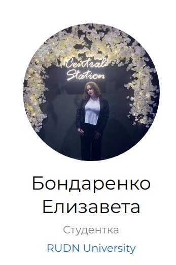
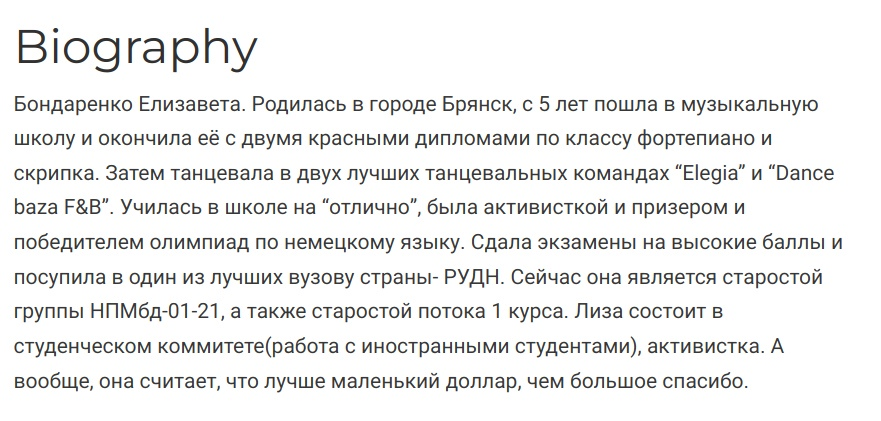
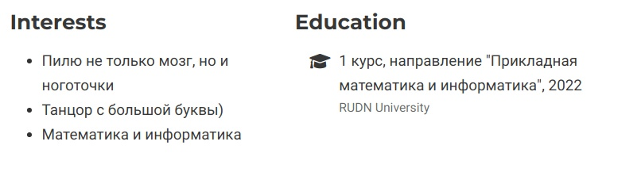
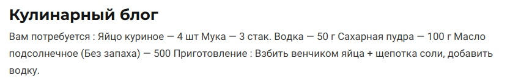
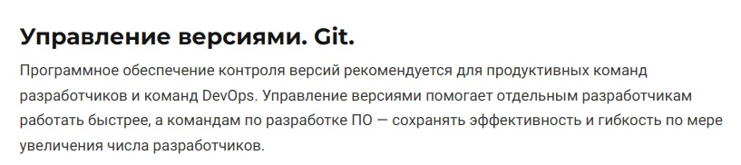

---
## Front matter
title: "Индивидуальный проект. 2 этап"
subtitle: "*дисциплина:операционные системы*"
author: "Бондаренко Елизавета Валентиновна"

## Generic otions
lang: ru-RU
toc-title: "Содержание"

## Bibliography
bibliography: bib/cite.bib
csl: pandoc/csl/gost-r-7-0-5-2008-numeric.csl

## Pdf output format
toc: true # Table of contents
toc-depth: 2
lof: true # List of figures
lot: true # List of tables
fontsize: 12pt
linestretch: 1.5
papersize: a4
documentclass: scrreprt
## I18n polyglossia
polyglossia-lang:
  name: russian
  options:
	- spelling=modern
	- babelshorthands=true
polyglossia-otherlangs:
  name: english
## I18n babel
babel-lang: russian
babel-otherlangs: english
## Fonts
mainfont: PT Serif
romanfont: PT Serif
sansfont: PT Sans
monofont: PT Mono
mainfontoptions: Ligatures=TeX
romanfontoptions: Ligatures=TeX
sansfontoptions: Ligatures=TeX,Scale=MatchLowercase
monofontoptions: Scale=MatchLowercase,Scale=0.9
## Biblatex
biblatex: true
biblio-style: "gost-numeric"
biblatexoptions:
  - parentracker=true
  - backend=biber
  - hyperref=auto
  - language=auto
  - autolang=other*
  - citestyle=gost-numeric
## Pandoc-crossref LaTeX customization
figureTitle: "Рис."
tableTitle: "Таблица"
listingTitle: "Листинг"
lofTitle: "Список иллюстраций"
lotTitle: "Список таблиц"
lolTitle: "Листинги"
## Misc options
indent: true
header-includes:
  - \usepackage{indentfirst}
  - \usepackage{float} # keep figures where there are in the text
  - \floatplacement{figure}{H} # keep figures where there are in the text
---

# Цель работы

Научиться вносить первоначальные данные на сайт

# Задание

Добавить к сайту данные о себе.

Список добавляемых данных:
- Разместить фотографию владельца сайта.
- Разместить краткое описание владельца сайта (Biography).
- Добавить информацию об интересах (Interests).
- Добавить информацию об образовании (Education).
- Сделать пост по прошедшей неделе.
Добавить пост на тему по выбору:
- Управление версиями. Git.
- Непрерывная интеграция и непрерывное развертывание (CI/CD).

# Выполнение индивидуального проекта

1. Размещаем фотографию владельца сайта (рис. [-@fig:001])

{ #fig:001 width=70% }

2. Размещаем краткое описание владельца сайта (рис. [-@fig:002])

{ #fig:002 width=70% }

3. Далее добавляем информацию об интересах и образовании (рис. [-@fig:003])

{ #fig:003 width=70% }

4. Делаем пост по прошедшей неделе(я выбрала информацию про рецепт любимого блюда) (рис. [-@fig:004])

{ #fig:004 width=70% }

5. Даётся на выбор 2 темы для поста, я выбрала "Управление версиями. Git." (рис. [-@fig:005])

{ #fig:005 width=70% }

# Выводы

В ходе выполнения 2 этапа индивидуального проекта я научилась добавлять данные к сайту о себе.

# Список литературы{.unnumbered}

::: {#refs}
:::
