---
## Front matter
title: "Отчёт по 4 этапу индивидуального проекта"
subtitle: "*дисциплина:операционные системы*"
author: "Бондаренко Елизавета Валентиновна"

## Generic otions
lang: ru-RU
toc-title: "Содержание"

## Bibliography
bibliography: bib/cite.bib
csl: pandoc/csl/gost-r-7-0-5-2008-numeric.csl

## Pdf output format
toc: true # Table of contents
toc-depth: 2
lof: true # List of figures
lot: true # List of tables
fontsize: 12pt
linestretch: 1.5
papersize: a4
documentclass: scrreprt
## I18n polyglossia
polyglossia-lang:
  name: russian
  options:
	- spelling=modern
	- babelshorthands=true
polyglossia-otherlangs:
  name: english
## I18n babel
babel-lang: russian
babel-otherlangs: english
## Fonts
mainfont: PT Serif
romanfont: PT Serif
sansfont: PT Sans
monofont: PT Mono
mainfontoptions: Ligatures=TeX
romanfontoptions: Ligatures=TeX
sansfontoptions: Ligatures=TeX,Scale=MatchLowercase
monofontoptions: Scale=MatchLowercase,Scale=0.9
## Biblatex
biblatex: true
biblio-style: "gost-numeric"
biblatexoptions:
  - parentracker=true
  - backend=biber
  - hyperref=auto
  - language=auto
  - autolang=other*
  - citestyle=gost-numeric
## Pandoc-crossref LaTeX customization
figureTitle: "Рис."
tableTitle: "Таблица"
listingTitle: "Листинг"
lofTitle: "Список иллюстраций"
lotTitle: "Список таблиц"
lolTitle: "Листинги"
## Misc options
indent: true
header-includes:
  - \usepackage{indentfirst}
  - \usepackage{float} # keep figures where there are in the text
  - \floatplacement{figure}{H} # keep figures where there are in the text
---

# Цель работы

Научиться добавлять к сайту достижения

# Задание

Добавить к сайту достижения.

1. Список достижений.
- Добавить информацию о навыках (Skills).
- Добавить информацию об опыте (Experience).
- Добавить информацию о достижениях (Accomplishments).
2. Сделать пост по прошедшей неделе.
3. Добавить пост на тему по выбору:
- Легковесные языки разметки.
- Языки разметки. LaTeX.
- Язык разметки Markdown.

# Выполнение лабораторной работы

1. Заходим в папку ~/work/blog/content/home, видим наличие файлов, которые нам нужны и работаем с ними (рис. [-@fig:001])

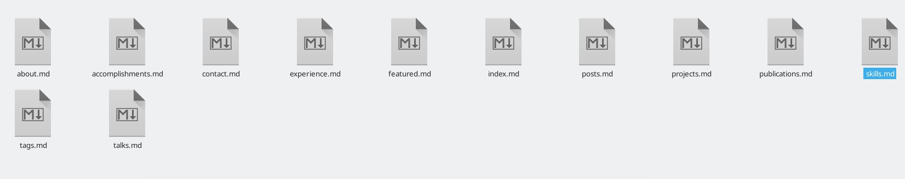{ #fig:001 width=70% }

В файле skills.md переходим по ссылке, где нам представлена информация о всех наборах иконок, воспользуемся набором emoji (рис. [-@fig:002])(рис. [-@fig:003])

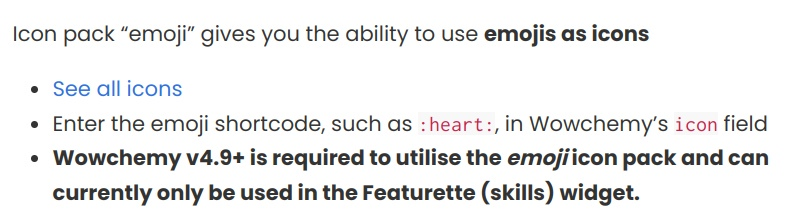{ #fig:002 width=70% }

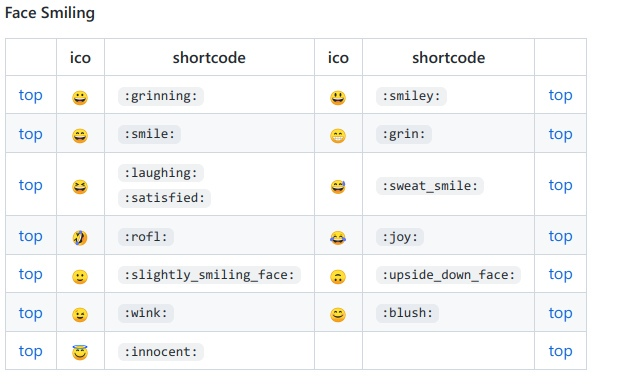{ #fig:003 width=70% }

Вносим изменения в наш файл(skills.md), все поля заполняем по форме, а позже проверяем результат (рис. [-@fig:004])(рис. [-@fig:005])

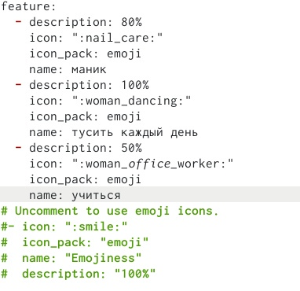{ #fig:004 width=70% }

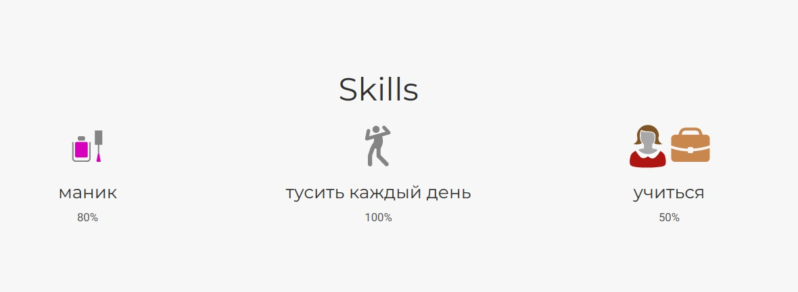{ #fig:005 width=70% }

Вносим изменения в наш файл(expierence.md), все поля заполняем по форме, а позже проверяем результат (рис. [-@fig:006])(рис. [-@fig:007])

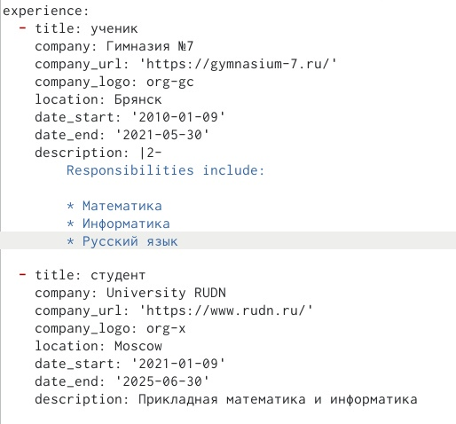{ #fig:006 width=70% }

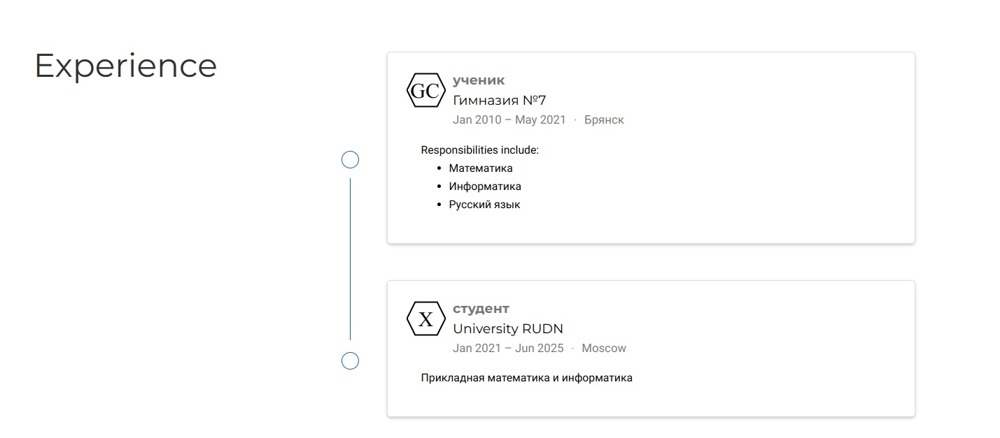{ #fig:007 width=70% }

Вносим изменения в наш файл(accomplishments.md), все поля заполняем по форме, а позже проверяем результат (рис. [-@fig:008])(рис. [-@fig:009])

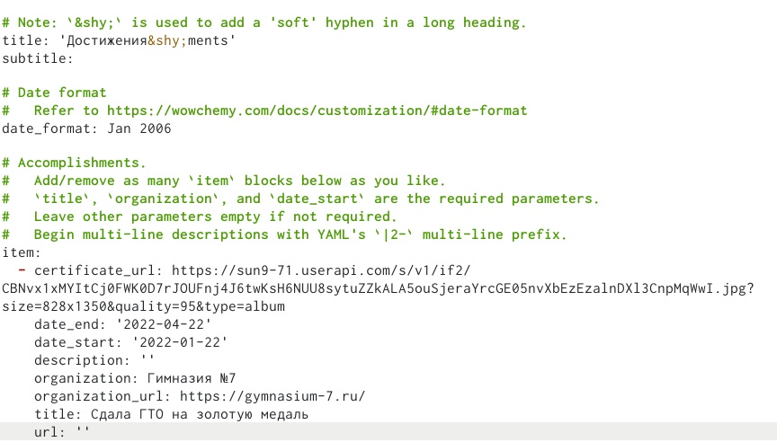{ #fig:008 width=70% }

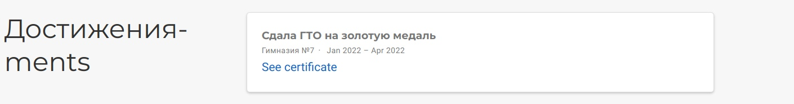{ #fig:009 width=70% }

2. В терминале с помощью команды hugo создаём новый документ post3.md в папке post (рис. [-@fig:010])

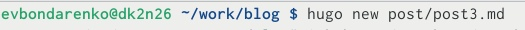{ #fig:010 width=70% }

Создаём пост о прошедшей неделе (рис. [-@fig:011])

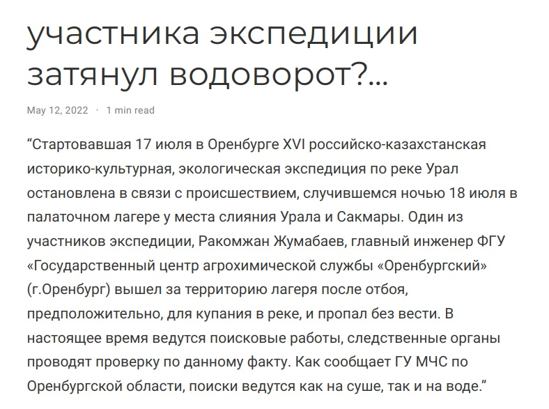{ #fig:011 width=70% }

3. Также создаём новый файл и создаём пост на выбор, я выбрала тему: "Язык разметки Markdown" (рис. [-@fig:012]) 

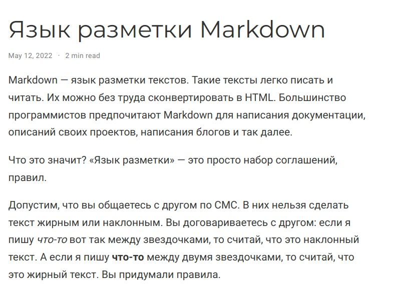{ #fig:012 width=70% }

# Выводы

В ходе выполнения 3 этапа индивидуального проекта я научилась добавлять к сатй достижения

# Список литературы{.unnumbered}

::: {#refs}
:::
